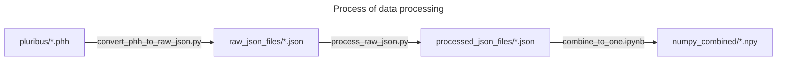

# Poker_AI

```mermaid
---
title: Process of data processing
---
  flowchart LR
    A[pluribus/*.phh] -- convert_phh_to_raw_json.py --> B[raw_json_files/*.json]
    B -- process_raw_json.py --> C[processed_json_files/*.json]
    C -- combine_to_one.ipynb --> D[numpy_combined/*.npy]
```
[Exploratory Data Analysis](hands_occurences.html)

